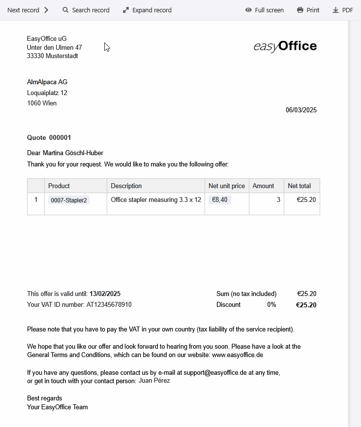
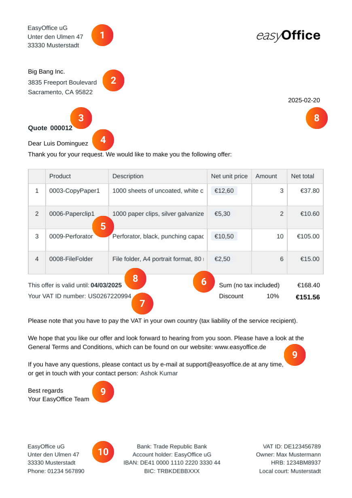
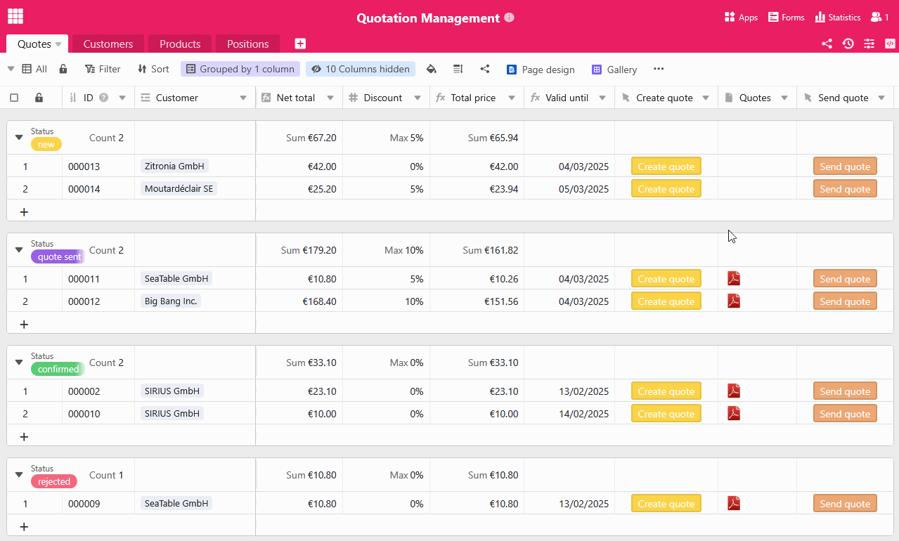

Gut gemacht! Wenn Sie für einen Kunden ein Angebot schreiben sollen, haben Sie bereits erfolgreich Interesse an Ihren Produkten oder Dienstleistungen geweckt. Nun geht es darum, den potenziellen Auftraggeber rundum von Ihrem Angebot zu überzeugen. Anstatt für jede einzelne Anfrage ein neues Angebot schreiben zu müssen, können Sie mit einer Angebot Vorlage den gesamten Prozess der Angebotserstellung automatisieren. Nutzen Sie dafür doch gleich dieAngebot schreiben Vorlagevon SeaTable, mit der Sie jedes Angebot online erstellen können – kostenlos, bequem und sicher!

## Warum Sie ein Angebot schreiben sollten

Ein übersichtlich und ansprechend gestaltetes Angebotsschreiben erhöht die Wahrscheinlichkeit, dass Ihr Interessent letztendlich anbeißt. Es dient zur beiderseitigen Absicherung und stellt klar, welche Leistungen Ihr Kunde für den genannten Preiserwarten kann. Während bei einer kleinen Bestellung womöglich eine formlose E-Mail ausreicht, sollten Sie bei größeren Aufträgen auf jeden Fall ein schriftliches Angebot erstellen, um die in Aussicht gestellten Vertragsbedingungen zu dokumentieren. Je präziser Sie die Angebotspositionen dabei ausführen, desto weniger Missverständnisse sind möglich.

Insbesondere, wenn Sie jeden Tag Anfragen erhalten, kann es viel Zeit und Nerven kosten,individuelle Angebotezu schreiben, die Sie immer wieder neu formulieren müssen – und das ohne zu wissen, ob aus Ihren Angeboten wirklich Aufträge werden. Hier schafft eine professionelle Angebotsvorlage gerade für Kleinunternehmer schnell und zuverlässig Abhilfe. Nutzen Sie, umeffizient und automatisiert Ihr Angebot zu schreiben, zum Beispiel SeaTable.

## Was für eine Angebotsvorlage spricht

Wenn Sie zum Angebot schreiben eine Vorlage nutzen, profitieren Sie von zahlreichen Verbesserungen, die Ihren Prozess zur Angebotserstellung effizienter, einfacher und robuster machen.

- Zeit sparen: Unsere digitale Angebot Vorlage ermöglicht Ihnen die automatische Generierung, den Versand und die Speicherung Ihrer Angebotsschreiben. So reduzieren Sie manuelle Eingaben und minimieren Ihren Verwaltungsaufwand.

- Keine Fehler: Durch die automatisierte Angebotserstellung mithilfe der dynamischen Felder und Formeln gibt es keine Rechen- und Tippfehler wie bei einer Angebotsvorlage in Word.

- Zentrale Speicherung: In SeaTable können Sie alle bestehenden Daten rund um Ihre Kunden, Produkte und Aufträge speichern, miteinander verknüpfen und in Dokumente einbetten.

- Nachhaltigkeit: Mit SeaTable läuft Ihre Angebotserstellung vollständig papierlos ab – ohne aufwändigen und teuren Versand, sondern einfach auf Knopfdruck per E-Mail.

## Wie Sie professionell ein Angebot erstellen

Wenn Sie noch nie ein Angebot erstellen mussten, wissen Sie wahrscheinlich gar nicht, wo Sie anfangen sollen. In diesem Fall hilft Ihnen unsere Vorlage für Ihr Angebot enorm weiter, denn sie enthält bereits alle Bestandteile für einekorrekte Angebotserstellung.

Folgende Pflichtangaben sollten in keiner Angebotsvorlage fehlen:

1. Wenn Sie ein Angebot schreiben, bilden der Name und die Adresse Ihres Unternehmensin der Regel zusammen mit Ihrem Firmenlogoden Briefkopf.

2. Den Namen und die Adresse des Auftraggebers / Kunden benötigen Sie nicht nur für die Lieferung, sondern auch aus steuerlichen Gründen – denn Leistungen an Unternehmen sind dort zu versteuern, wo der Auftraggeber seinen Sitz hat.

3.Betreffzeile und Angebotsnummer: Eine eindeutige, fortlaufende Nummerierung Ihrer Angebote erleichert die Zuordnung bei zukünftigem Schriftverkehr mit Ihren Kunden.

4. Die direkte Anrede mit dem Namen des Ansprechpartners verleiht Ihrem Angebotsschreiben eine persönliche Note.

5. Die genaue Angebotsbeschreibung mit den einzelnen Positionen (Art, Preis und Menge der Leistung) bildet den Hauptteil Ihres Angebots. Es muss klar sein, in welchem Umfang Sie Ihre Produkte oder Dienstleistungen anbieten.

6. Nun geht es ans Eingemachte: Addieren Sie die Einzelposten zum Nettobetrag zusammen, ziehen Sie gegebenenfalls einen Rabattab und berechnen Sie bei Kunden im Inland auch den Bruttobetrag inklusive gesetzlicher Mehrwertsteuer.

7. Bei Unternehmenskunden im Ausland benötigen Sie die Umsatzsteuer-Identifikationsnummer, wenn Sie ein Angebot schreiben. Weisen Sie diese Kunden darauf hin, dass sie die Umsatzsteuer in ihrem jeweiligen Land selbst zu entrichten haben (Steuerschuldnerschaft des Leistungsempfängers).

8.Datum und Gültigkeit: Vergessen Sie nicht das aktuelle Datum, wenn Sie ein Angebot erstellen, und fügen Sie eine Frist hinzu, bis wann der Kunde es annehmen kann. In der Regel sollte der Zeitraum, für den Sie rechtlich an Ihr Angebot gebunden sind, nur ein paar Wochen betragen.

9. Schließen Sie den Angebotstext mit einem freundlichen Abbinder und einer Grußformel ab. Am besten weisen Sie den Kunden im Angebotsschreiben auch auf IhreA llgemeinen Geschäftsbedingungen (AGB)​hin.

10. Im Brieffuß Ihrer Angebotsvorlage sollten Ihre Bankverbindung, Ihre Umsatzsteuer-ID und andere relevante Firmendaten Platz finden.

## Gewinnen Sie Kunden, indem Sie transparente Angebote schreiben

Natürlich haben Ihre potenziellen Kunden ein großes Interesse daran, vor einem Auftrag die genauen Kostenzu kennen. Gerade bei längerfristigen Dienstleistungen – beim Angebot schreiben zum Beispiel für ein Bauprojekt – kann es für die Leistungserbringer allerdings schwierig sein, alle Kosten korrekt einzuschätzen und verbindliche Festpreise zu nennen. In diesem Fall empfiehlt sich ein Kostenvoranschlag, der noch deutlich mehr Spielraum bietet.

### Was ist der Unterschied zwischen Angebot und Kostenvoranschlag?

Wenn Sie ein Angebot schreiben, sind die angegebenen Preise und Leistungen rechtlich bindend, sofern Sie nichts anderes in der Angebotsvorlage vermerkt haben. Bei Annahme des Angebots kommt direkt ein Kaufvertrag mit dem Kunden zustande. Dahingegen ist ein Kostenvoranschlag nur eine unverbindliche Prognose bzw. eine vorläufige Berechnung von Kosten, die sich noch ändern können.

Achten Sie deshalb darauf, Ihr Angebotsschreiben mit einer Freiheitsklausel wie "unverbindliches Angebot" zu kennzeichnen, wenn Sie sich die Option offenhalten möchten, es zurückzuziehen oder die Konditionen anzupassen. Stellen Sie dies idealerweise in Ihren AGB klar und erwähnen Sie diese in der Angebot Vorlage.

Aber Vorsicht: Auch bei einem Kostenvoranschlag sollte der Endpreis um maximal 15 Prozent von Ihrer Schätzung abweichen. Kommen unerwartete Kosten oder Mehraufwändeauf Sie zu, müssen Sie zuerst die Zustimmung des Kunden einholen. Kalkulieren Sie daher immer realistisch.

## Die vielfältigen Funktionen unserer Angebot Vorlage

• Unsere Angebot schreiben Vorlage können Sie individuell an Ihre Wünsche und Bedürfnisse anpassen. Gestalten Sie die Angebot Vorlage mit dem Seitendesign-Plugin und nutzen Sie vielfältige Spaltentypen und Visualisierungsmöglichkeiten.

• Erstellen Sie Ihre Angebotsvorlage in verschiedenen Sprachen bzw. für verschiedene Länder und definieren Sie Abhängigkeiten, sodass immer automatisch die passende Vorlage ausgewählt wird.

• Sobald Sie die Angebot Vorlage mit Ihren Daten und individuellen Designs befüllt haben, erfolgt das Angebot erstellen kostenlos und automatisiert per Knopfdruck– ganz ohne weiteren Aufwand Ihrerseits.

• Auch den Versand können Sie automatisieren: Durch die Integration mit Ihrem E-Mail-Provider lässt sich mit nur einem Klick ein Angebot schreiben unddirekt per E-Mail verschicken.

• Nutzen Sie die in die Angebot Vorlage integrierten Statistiken, um wertvolle Erkenntnisse aus Ihren Zahlen und Daten zu gewinnen und fundierte Entscheidungen zu treffen.

## Effizient Angebote schreiben – so einfach kann es sein

Mit der Angebot schreiben Vorlage von SeaTable wird die Angebotserstellung und -verwaltung zum Kinderspiel. Die Vorlage für Ihr Angebot hilft Ihnen,Produkte,Kunden und Aufträge übersichtlich zu organisieren, automatisch das Angebot zu erstellen und als PDF versandfertig zu speichern.

Dank intelligenter Verknüpfungen speist sich die Angebotsvorlage aus relevanten Daten verschiedener Tabellen: Kundeninformationen, Bestellpositionen und Preise fließen nahtlos zusammen, während Formel nautomatisch Rabatte und Mehrwertsteuern berechnen. Mit der Angebotsvorlage behalten Kleinunternehmer wie Großunternehmen stets den Überblick und sparen wertvolle Zeit.

### Angebot erstellen leicht gemacht

Besonders praktisch für die Angebot erstellen Vorlage ist das Seitendesign-Plugin, mit dem Sie Angebotsschreiben in mehreren Sprachengestalten können. Ein einziger Klick genügt, um ein Angebot als PDF zu speichern – je nach Land des Kunden nutzt SeaTable automatisch die passende Angebotsvorlage. Dank der benutzerfreundlichen Oberfläche können Sie so in kürzester Zeit ein Angebot schreiben. Auch der Versand ist integriert: Mit einem weiteren Button lässt sich das fertige Angebot direkt per E-Mail an den Kunden verschicken. So läuft der gesamte Prozess effizient und reibungslos, ohne umständliches Kopieren oder manuelles Tippen.

### Mehr als eine Angebot schreiben Vorlage

Neben der Angebotserstellung bietet die Angebot schreiben Vorlage wertvolle Zusatzfunktionen, die Ihr Geschäft unterstützen. Die Statistik-Funktion ermöglicht eine einfache Auswertung von Verkaufszahle nund Umsätzen, während das Galerie-Plugin Ihnen eine Übersicht über Ihr Produktportfolio bietet. Dank der flexiblen Anpassungsmöglichkeiten von SeaTable können Sie Spalten, Berechnungen und Ansichten individuell auf Ihre Bedürfnisse abstimmen und so eine Angebotsvorlage erstellen, die genau zu Ihrem Unternehmen passt.

## Vorteile von SeaTable als Software zur Angebotserstellung

- Kostenlos: Die Angebot schreiben Vorlage ist kostenlos. Starten Sie mit der Free-Version von SeaTable, die bereits zahlreiche Funktionen umfasst. Bei Bedarf können Sie einfach upgraden, um mehr Funktionen oder Speicherplatz für die Angebotserstellung zu erhalten.

- Kollaborativ: Dank der Echtzeit-Synchronisation erleichtert SeaTable die Zusammenarbeit im Team erheblich. Mehrere Nutzer können gleichzeitig an Tabellen arbeiten, Daten in der Angebot Vorlage aktualisieren und Kommentare hinterlassen.

- Bequem: Wenn Sie ein Angebot online erstellen, ist es von überall und zu jeder Zeit zugänglich und gleichzeitig vor Verlust geschützt. Anders als bei einer Angebotsvorlage in Word können Sie zudem strukturiert Daten speichern und automatisch Dokumente daraus generieren.

- Flexibel: SeaTable ist weit mehr als nur eine Datenbank. Durch seine vielseitigen Anpassungsmöglichkeiten lässt es sich für unterschiedlichste Anwendungsfälle nutzen und nahtlos in verschiedene Geschäftsprozesse integrieren.

- Sicher: Ihre Daten sind bei SeaTable bestens geschützt. Sie haben die Wahl, ob Sie diese in der Cloud oder On-Premises speichern. Dank DSGVO-Konformität und individuellen Zugriffsrechten behalten Sie jederzeit die volle Kontrolle über Ihre Daten.

- Skalierbar: Von der ersten Nutzung mit wenigen Mitarbeitern bis hin zu einer unternehmensweiten Lösung für große Teams – SeaTable wächst mit Ihren Anforderungen. Natürlich können Sie mit dieser Vorlage Ihr Angebot auch als Kleinunternehmer kostenlos erstellen.

## Steigern Sie Ihren Umsatz durch ansprechende Angebote mit SeaTable

Ob als Angebotsvorlage für Kleinunternehmer oder Software zur Angebotserstellung für große Unternehmen – mit SeaTable ist es ein Kinderspiel, für jeden Auftrag ein Angebot zu erstellen. Nutzen Sie die automatisierte Angebotserstellung, mit der Sie im Handumdrehen ein Angebot nach dem anderen online erstellen und versenden. So haben Sie wieder mehr Zeit für die wichtigen Dinge, anstatt wertvolle Stunden mit dem Angebot schreiben zu verschwenden.

Wenn Sie die Angebot schreiben Vorlage kostenlos nutzen möchten,registrieren Sie sich einfach mit Ihrer E-Mail-Adresse.

## Interaktives Template

Scrollen Sie durch unser interaktiv eingebettetes Template oder lesen Sie die Beschreibung, indem Sie auf das  hinter dem Vorlagennamen klicken. So bekommen Sie ein besseres Gefühl für die Funktionen der Angebot schreiben Vorlage. Bei Fragen werfen Sie bitte einen Blick in unseren [Hilfebereich]().

​
