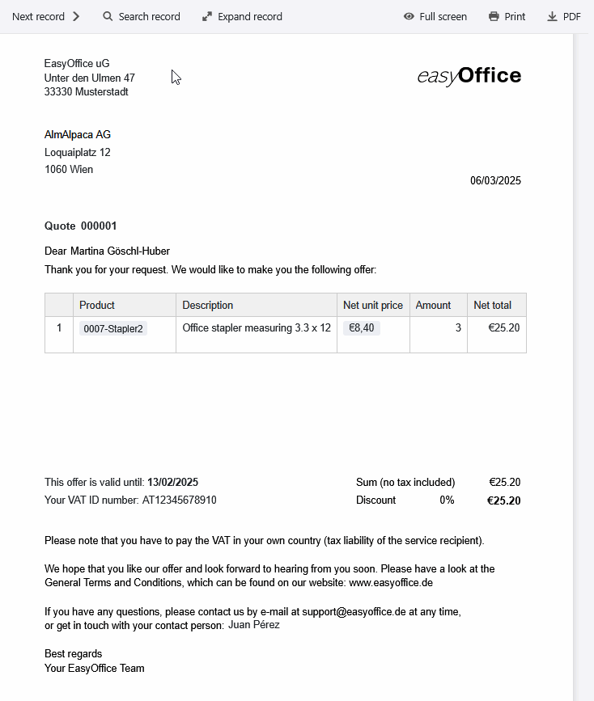

Well done! If you have to write a quotation for a customer, you have already successfully aroused interest in your products or services. Now it's all about convincing the potential client of your offer. Instead of having to write a new quote for each individual inquiry, you can automate the entire process of creating a quote with a quote template. Why not use SeaTable'squotation templateright away, with which you can create every quotation online - free of charge, conveniently and securely!

## Why you should write an offer

A clearly and attractively designedoffer letterincreases the likelihood that your prospective customer will ultimately take the bait. It serves as a mutual assurance and makes it clear whatservicesyour customer can expect for thepricequoted. While an informal email may be sufficient for a small order, you should definitely prepare a written offer for larger orders in order to document the proposed contractual conditions. The more precisely you specify theitems in the quotation, the fewer misunderstandings are possible.

Especially if you receive inquiries every day, it can take a lot of time and nerves to writeindividual offersthat you have to reformulate again and again - without knowing whether your offers will actually result in orders. This is where a professional quotation template provides a quick and reliable remedy, especially for small businesses. Use SeaTable, for example, to write your quotationefficientlyandautomatically.

## What speaks in favor of an offer template

When you use a template to write a quotation, you benefit from numerous improvements that make your quotation creation process more efficient, easier and more robust.

-Save time: Our digital offer template allows you to automatically generate, send and save your offer letters. This reduces manual input and minimizes your administrative workload.

-No errors: thanks to automated quotation creation using dynamic fields and formulas, there are no calculation or typing errors as with a quotation template in Word.

-Central storage: In SeaTable you can store all existing data relating to your customers, products and orders, link them together and embed them in documents.

-Sustainability: With SeaTable, your quotation preparation is completely paperless - without time-consuming and expensive dispatch, but simply at the touch of a button by e-mail.

## How to create a professional quote

If you've never had to create a quote before, you probably don't know where to start. In this case, our template for your quotation will help you enormously, as it already contains all the elements you need toprepare a correct quotation.

The following mandatory information should not be missing from any offer template:

1. when you write an offer, thenameandaddress of your companyusually form the letterhead together with yourcompany logo.

2. you need thenameandaddress of the client/customernot only for the delivery, but also for tax reasons - because services to companies are taxable where the client is based.

3.subject lineandquotation number: A clear, consecutive numbering of your quotations makes it easier to assign them in future correspondence with your customers.

4. the directsalutationwith the name of the contact person gives your offer letter a personal touch.

5 The exact description of the offer with the individualitems(type, price and quantity of the service) forms the main part of your offer. It must be clear to what extent you are offering your products or services.

6 Now it's time to get down to business: add up the individual items to thenet amount, deduct adiscountif necessary and, for domestic customers, also calculate the gross amount includingVAT.

7 For business customers abroad, you need theVAT identification numberwhen you write an offer. Point out to these customers that they must pay the VAT in their respective country themselves (tax liability of the recipient of the service).

8.dateandvalidity: Don't forget the actual date when you create an offer and add a deadline by which the customer can accept it. As a rule, the period for which you are legally bound by your offer should only be a few weeks.

9. conclude the offer text with a friendlyclosingand agreeting. It is also best to draw the customer's attention to yourGeneral Terms and Conditions (GTC)in the offer letter.

10. yourbank details,VAT IDand other relevant company data should be included in the letterhead of your offer template.

## Win customers by writing transparent offers

Naturally, your potential customers have a great interest in knowing the exactcostsbefore placing an order. However, it can be difficult for service providers to correctly estimate all costs and quote binding fixed prices, especially when it comes to longer-term services - for example, when writing a quote for a construction project. In this case, acost estimateis recommended, which offers significantly more leeway.

### What is the difference between a quote and a cost estimate?

If you write an offer, the prices and services stated arelegally bindingunless you have stated otherwise in the offer template. If the offer is accepted, apurchase contractis concluded directly with the customer. On the other hand, a cost estimate is only anon-binding forecastor apreliminary calculationof costs that are subject to change.

Therefore, make sure to mark your offer letter with afreedom clausesuch as "non-binding offer" if you want to keep the option open to withdraw it or adjust the conditions. Ideally, make this clear in your GTC and mention it in the offer template.

But be careful: even with a cost estimate, the final price should not deviate from your estimate by more than 15 percent. If you are faced withunexpected costs or additional expenses, you must first obtain the customer's approval. Therefore, always calculate realistically.

## The diverse functions of our offer template

- You can customize our quote template to suit your wishes and needs. Design the quote template with thepage design pluginand use a variety of column types and visualization options.

- Create your offer templatein different languagesor for different countries and define dependencies so that the appropriate template is always selected automatically.

- As soon as you have filled in the quotation template with your data and individual designs, the quotation is created free of charge andautomatically at the touch of a button- without any further effort on your part.

- You can also automate the sending process: Integration with your e-mail provider allows you to write a quote with just one click andsenditdirectly by e-mail.

- Use thestatisticsintegrated into the offer template to gain valuable insights from your figures and data and make well-founded decisions.

## Writing offers efficiently - it can be that simple

With SeaTable's quotation template, creating and managing quotations is child's play. The template for your quote helps you to clearly organizeproducts,customersandorders, automatically create the quote and save it as a PDF ready for dispatch.

Thanks to intelligentlinks, the quotation template is fed with relevant data from various tables: Customer information, order items and prices flow together seamlessly, whileformulasautomatically calculate discounts and VAT. With the quotation template, small and large companies alike always have an overview and save valuable time.

### Creating a quote made easy

The page design plugin, which allows you to designquotation letters in several languages, is particularly practical for the quotation template. A single click is all it takes to save a quoteas a PDF- SeaTable automatically uses the appropriate quote template depending on the customer's country. Thanks to the user-friendly interface, you can write a quotation in no time at all. Shipping is also integrated: With an additional button, the finished quote can be sent directlyto the customerbyemail. The entire process runs efficiently and smoothly, without cumbersome copying or manual typing.

### Write more than one quote template

In addition to creating quotes, the write quote template offers valuable additional functions that support your business. The statistics function makes it easy toevaluate sales figuresand turnover, while the gallery plugin gives you an overview of yourproduct portfolio. Thanks to SeaTable's flexible customization options, you can tailor columns, calculations and views to your individual needs and create a quote template that fits your business perfectly.

## Advantages of SeaTable as software for preparing quotations

-Free of charge: The quote writing template is free of charge. Start with the free version of SeaTable, which already includes numerous functions. If required, you can easily upgrade to get more functions or storage space for creating quotes.

-Collaborative: Thanks to real-time synchronization, SeaTable makes team collaboration much easier. Multiple users can work on tables, update data in the quote template and leave comments at the same time.

-Convenient: If you create a quotation online, it is accessible from anywhere and at any time and is also protected against loss. Unlike a quotation template in Word, you can also save structured data and automatically generate documents from it.

-Flexible: SeaTable is much more than just a database. Thanks to its versatile customization options, it can be used for a wide range of applications and seamlessly integrated into various business processes.

-Secure: Your data is optimally protected with SeaTable. You have the choice of storing it in the cloud or on-premises. Thanks to GDPR compliance and individual access rights, you retain full control over your data at all times.

-Scalable: From the first use with a few employees to a company-wide solution for large teams - SeaTable grows with your requirements. Of course, you can also use this template to create your offer free of charge as a small business.

## Increase your sales through appealing offers with SeaTable

Whether as a quotation template for small businesses or quotation creation software for large companies, SeaTable makes it easy to create a quotation for every order. Use theautomated quotation generationfeature to create and send one quotation after another online in no time at all. This gives you more time for the important things instead of wasting valuable hours writing quotes.

If you would like to use the offer writing template free of charge,simply register with your e-mail address.

## Interactive template

Scroll through our interactively embedded template or read the description by clicking on the  after the template name. This will give you a better feel for the functions of the quote writing template. If you have any questions, please take a look at our [help section]().

​
