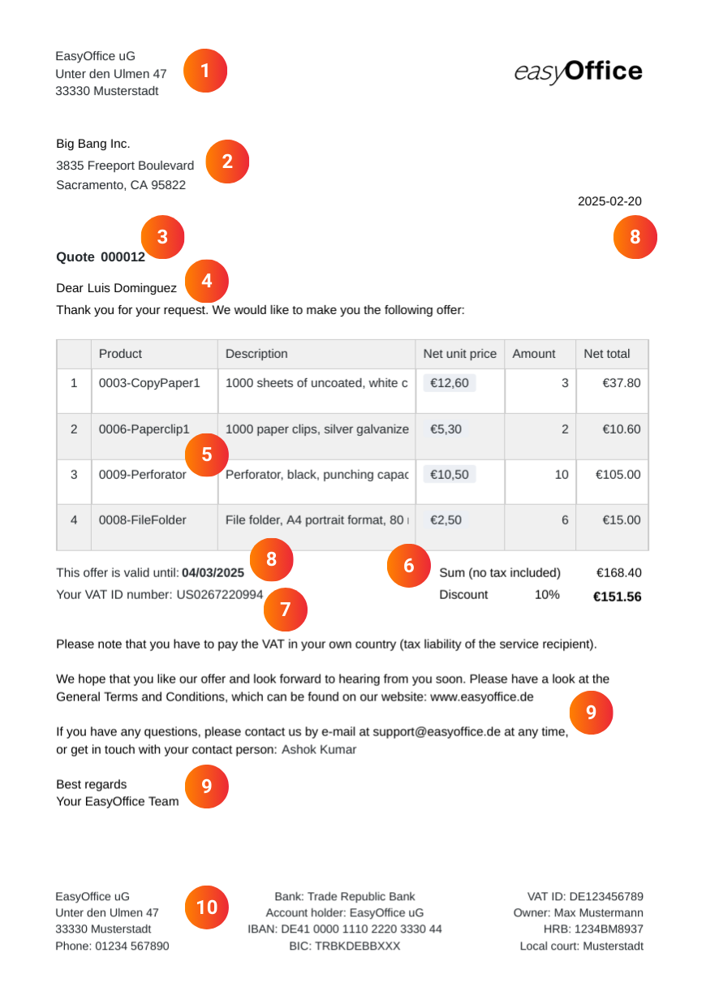

Bien joué ! Si vous devez rédiger une offre pour un client, vous avez déjà réussi à éveiller l'intérêt pour vos produits ou services. Il s'agit maintenant de convaincre le client potentiel de votre offre. Au lieu de devoir rédiger une nouvelle offre pour chaque demande, vous pouvez automatiser l'ensemble du processus de rédaction d'une offre à l'aide d'un modèle d'offre. Utilisez lemodèle de devisde SeaTable pour créer n'importe quel devis en ligne - gratuitement, facilement et en toute sécurité !

## Pourquoi rédiger une offre

Unelettre d'offreclaire et attrayante augmente la probabilité que votre prospect morde finalement à l'hameçon. Elle sert de garantie pour les deux parties et indique clairement lesprestationsque votre client peut attendre pour leprixindiqué. Alors qu'un e-mail informel peut suffire pour une petite commande, vous devez absolument rédiger une offre écrite pour les commandes plus importantes afin de documenter les conditions contractuelles envisagées. Plus leséléments de l'offreseront précis, moins il y aura de risques de malentendus.

En particulier si vous recevez des demandes tous les jours, cela peut vous coûter beaucoup de temps et d'énervement de rédigerdes offres individuellesque vous devez sans cesse reformuler - et cela sans savoir si vos offres se transformeront réellement en commandes. Un modèle d'offre professionnel permet de remédier rapidement et de manière fiable à ce problème, en particulier pour les petites entreprises. Utilisez par exemple SeaTable pour rédiger votre offre demanière efficaceetautomatisée.

## Ce qui plaide en faveur d'une soumission d'offre

Si vous utilisez un modèle pour rédiger votre offre, vous bénéficierez de nombreuses améliorations qui rendront votre processus de création d'offre plus efficace, plus simple et plus robuste.

- Gagnez du temps: Notre modèle d'offre numérique vous permet de générer, d'envoyer et d'enregistrer automatiquement vos lettres d'offre. Vous réduisez ainsi les saisies manuelles et minimisez votre charge administrative.

- Pas d'erreurs: grâce à la création automatisée d'offres à l'aide de champs et de formules dynamiques, il n'y a pas d'erreurs de calcul ou de frappe comme avec un modèle d'offre dans Word.

- Stockage centralisé: SeaTable vous permet de stocker toutes les données existantes relatives à vos clients, produits et commandes, de les relier entre elles et de les intégrer dans des documents.

- Durabilité: avec SeaTable, votre devis se déroule entièrement sans papier - sans envoi compliqué et coûteux, mais simplement en appuyant sur un bouton par e-mail.

## Comment établir une offre de manière professionnelle

Si vous n'avez jamais eu à rédiger une offre, vous ne savez probablement pas par où commencer. Dans ce cas, notre modèle d'offre vous sera d'une grande aide, car il contient déjà tous les éléments nécessaires à l'établissement d'une offre correcte.

Les informations obligatoires suivantes ne devraient manquer dans aucun modèle d'offre :

1. lorsque vous rédigez une offre, lenomet l'adresse de votre entrepriseforment généralement l'en-tête, avecle logo devotreentreprise

2. vous avez besoin dunomet de l'adresse du donneur d'ordre/clientnon seulement pour la livraison, mais aussi pour des raisons fiscales - car les prestations fournies à des entreprises sont imposables là où le donneur d'ordre a son siège.

3.ligne d'objetetnuméro de l'offre: une numérotation claire et continue de vos offres facilite leur classement dans les futures correspondances avec vos clients.

4. l'adressedirecte avec le nom de la personne de contact donne une touche personnelle à votre lettre d'offre.

5. la description précise de l'offre avec les différentspostes(type, prix et quantité de la prestation) constitue la partie principale de votre offre. Il doit être clair dans quelle mesure vous proposez vos produits ou services.

6. il faut maintenant entrer dans le vif du sujet : additionnez les postes individuels pour obtenir lemontant net, déduisez éventuellement uneremiseet, pour les clients en Suisse, calculez également le montant brut,TVAlégale incluse.

7) Pour les entreprises clientes à l'étranger, vous avez besoin dunuméro d'identification TVAlorsque vous rédigez une offre. Indiquez à ces clients qu'ils doivent eux-mêmes s'acquitter de la TVA dans leur pays respectif (obligation fiscale du destinataire de la prestation).

8)Dateetvalidité: n'oubliez pas la date du jour lorsque vous rédigez une offre et ajoutez un délai pour que le client puisse l'accepter. En règle générale, la période pendant laquelle vous êtes légalement lié par votre offre ne devrait être que de quelques semaines.

9. terminez le texte de l'offre par unsigne de ralliementamical et uneformule de salutations. Il est préférable d'attirer l'attention du client sur vosconditions générales de vente (CGV)dans la lettre d'offre.

10) Le pied de page de votre modèle d'offre doit contenir voscoordonnées bancaires, votrenuméro de TVAet d'autres informations pertinentes sur votre entreprise.

## Gagnez des clients en rédigeant des offres transparentes

Il est évident que vos clients potentiels ont tout intérêt à connaître lescoûtsexacts avant de passer commande. Toutefois, il peut être difficile pour les prestataires d'estimer correctement tous les coûts et de proposer des prix fermes, en particulier pour les services à long terme - lors de la rédaction d'une offre pour un projet de construction par exemple. Dans ce cas, il est recommandé d'établir un devis, qui offre une marge de manœuvre nettement plus importante.

### Quelle est la différence entre une offre et un devis ?

Lorsque vous rédigez une offre, les prix et prestations indiquéssont juridiquement contraignants, sauf mention contraire dans le modèle d'offre. En cas d'acceptation de l'offre, uncontrat de venteest directement conclu avec le client. En revanche, un devis n'est qu'unpronostic sans engagementou uncalcul provisoiredes coûts, qui peuvent encore être modifiés.

Veillez donc à marquer votre lettre d'offre d'uneclause de libertételle que "offre sans engagement" si vous souhaitez garder l'option de la retirer ou d'en adapter les conditions. Dans l'idéal, clarifiez ce point dans vos conditions générales et mentionnez-le dans le modèle d'offre.

Mais attention : même avec un devis, le prix final ne devrait pas s'écarter de plus de 15 % de votre estimation. Si vous devez faire face àdes coûts inattendus ou à des dépenses supplémentaires, vous devez d'abord obtenir l'accord du client. Soyez donc toujours réaliste dans vos calculs.

## Les multiples fonctions de notre modèle d'offre

- Vous pouvez adapter notre modèle d'offre à vos souhaits et à vos besoins. Créez votre modèle d'offre à l'aide duplug-in de conception de pageset utilisez de nombreux types de colonnes et de possibilités de visualisation.

- Créez votre modèle d'offredans différentes languesou pour différents pays et définissez des dépendances afin que le modèle approprié soit toujours sélectionné automatiquement.

- Dès que vous avez rempli le modèle d'offre avec vos données et vos designs individuels, la création de l'offre se fait gratuitement etautomatiquement en appuyant sur un bouton- sans aucun effort de votre part.

- Vous pouvez également automatiser l'envoi : Grâce à l'intégration avec votre fournisseur de messagerie, un seul clic suffit pour rédiger une offre et l'envoyer directement par e-mail.

- Utilisez lesstatistiquesintégrées dans le modèle d'offre pour tirer de précieux enseignements de vos chiffres et données et prendre des décisions éclairées.

## Rédiger des offres de manière efficace - cela peut être aussi simple que cela

Avec le modèle Rédiger un devis de SeaTable, la création et la gestion de devis deviennent un jeu d'enfant. Le modèle de devis vous aide à organiser clairement lesproduits,les clientsetles commandes, à créer automatiquement le devis et à l'enregistrer au format PDF prêt à être envoyé.

Grâce àdes liensintelligents, le modèle d'offre se nourrit des données pertinentes de différents tableaux : Les informations sur les clients, les postes de commande et les prix s'intègrent parfaitement, tandis queles formulescalculent automatiquement les remises et la TVA. Le modèle de devis permet aux petites et grandes entreprises de garder une vue d'ensemble et de gagner un temps précieux.

### Créer une offre, c'est facile

Le plug-in de conception de page est particulièrement pratique pour le modèle de création de devis, car il permet de concevoirdes lettres de devis en plusieurs langues. Un seul clic suffit pourenregistrerune offreau format PDF- selon le pays du client, SeaTable utilise automatiquement le modèle d'offre approprié. Grâce à l'interface conviviale, vous pouvez ainsi rédiger une offre en un rien de temps. L'envoi est également intégré : Un autre bouton permet d'envoyer l'offre terminée directement pare-mail au client. L'ensemble du processus se déroule ainsi de manière efficace et sans accroc, sans avoir à copier ou à taper manuellement.

### Rédiger plus d'une offre Modèle

Outre la création d'offres, le modèle Écrire une offre offre offre des fonctions supplémentaires précieuses qui soutiennent votre activité. La fonction de statistiques permet d'évaluerfacilementles chiffres de venteet le chiffre d'affaires, tandis que le plug-in de galerie vous offre un aperçu de votreportefeuille de produits. Grâce aux options de personnalisation flexibles de SeaTable, vous pouvez personnaliser les colonnes, les calculs et les affichages pour créer un modèle de devis qui correspond exactement à votre entreprise.

## Avantages de SeaTable en tant que logiciel de création de devis

-Gratuitpour vous : Le modèle Rédiger une offre est gratuit. Commencez avec la version gratuite de SeaTable, qui comprend déjà de nombreuses fonctionnalités. Si vous le souhaitez, vous pouvez facilement mettre à niveau votre version pour bénéficier de plus de fonctionnalités ou d'espace de stockage pour la rédaction de vos offres.

-Collaboratif: grâce à la synchronisation en temps réel, SeaTable facilite considérablement le travail en équipe. Plusieurs utilisateurs peuvent travailler simultanément sur des tableaux, mettre à jour des données dans le modèle d'offre et laisser des commentaires.

-Confortable: lorsque vous créez une offre en ligne, elle est accessible de partout et à tout moment, tout en étant protégée contre la perte. Contrairement à un modèle d'offre dans Word, vous pouvez en outre enregistrer des données structurées et générer automatiquement des documents à partir de celles-ci.

-Flexible: SeaTable est bien plus qu'une simple base de données. Grâce à ses multiples possibilités de personnalisation, elle peut être utilisée dans les cas d'application les plus divers et s'intégrer de manière transparente dans différents processus commerciaux.

-Sûr: vos données sont parfaitement protégées chez SeaTable. Vous avez le choix de les stocker dans le cloud ou sur site. Grâce à la conformité au RGPD et aux droits d'accès individuels, vous gardez à tout moment le contrôle total de vos données.

-Évolutif: de la première utilisation avec quelques employés à une solution d'entreprise pour de grandes équipes, SeaTable évolue avec vos besoins. Bien entendu, ce modèle vous permet de créer votre offre gratuitement, même si vous êtes un petit entrepreneur.

## Augmentez vos ventes grâce à des offres attrayantes avec SeaTable

Qu'il s'agisse d'un modèle de devis pour les petits entrepreneurs ou d'un logiciel de création de devis pour les grandes entreprises, avec SeaTable, créer un devis pour chaque commande est un jeu d'enfant. Utilisez la fonctionde création automatique de devisqui vous permet de créer et d'envoyer des devis en ligne les uns après les autres en un clin d'œil. Vous aurez ainsi plus de temps à consacrer aux choses importantes au lieu de perdre de précieuses heures à rédiger des devis.

Si vous souhaitez utiliser gratuitement le modèle Rédiger une offre,il vous suffit de vous inscrire avec votre adresse e-mail.

## Modèle interactif

Faites défiler notre modèle intégré de manière interactive ou lisez la description en cliquant sur l'icône i derrière le nom du modèle. Vous aurez ainsi une meilleure idée des fonctions du modèle Écrire une offre. Si vous avez des questions, n'hésitez pas à consulter notrerubrique d'aide.

​
