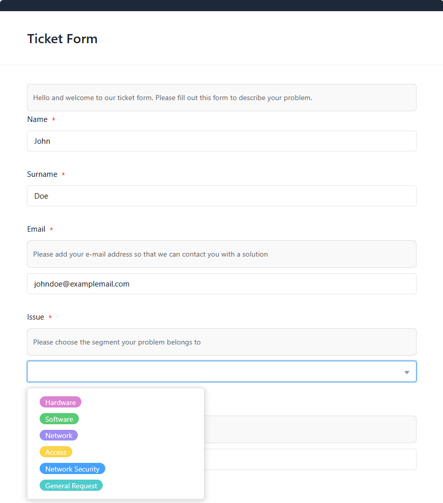
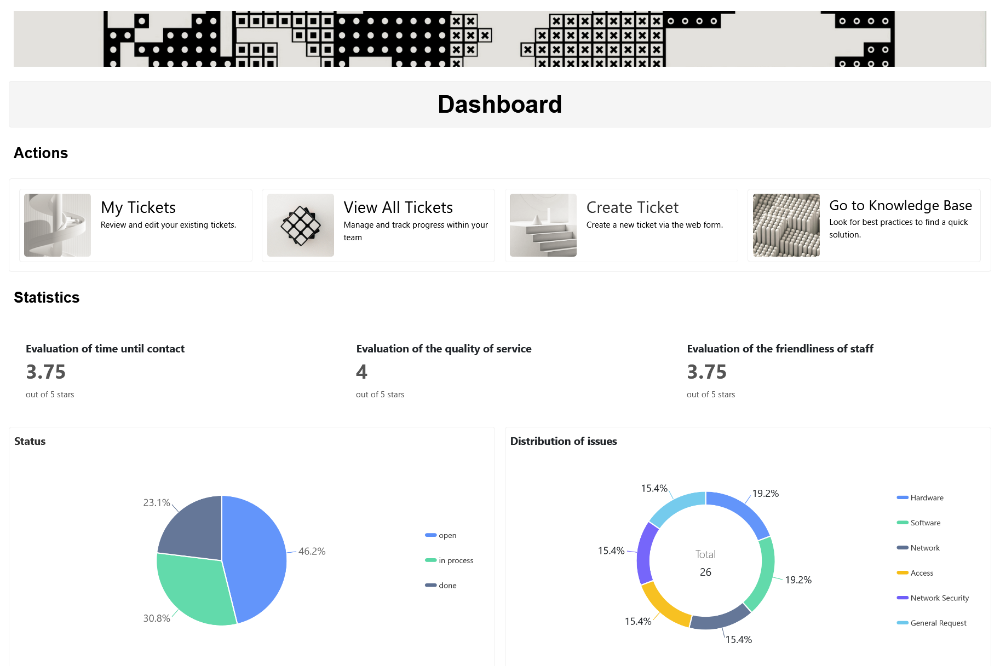

Ein Ticketing System in SeaTable hilft Ihnen dabei, alle Support-Anfragen zentral zu erfassen, zu organisieren und zu lösen. Mit dieserIT-Helpdesk-Softwaresteuern Sie alle Abläufe – von der Bearbeitung neuer Anfragen über das Wissensmanagement bis hin zur Servicequalität – effizient und strukturiert.

## Erfassen und verwalten Sie Ihre Tickets zentral

Die zentrale Tabelle der Helpdesk Software erfasst alle eingehenden Anfragen über ein individuell anpassbaresWebformular.

Jedem Eintrag können Sie wichtige Informationen wieStatus,Prioritätund eineverantwortliche Personzuweisen. Dank automatischer Zuweisung an Ihre Teammitglieder nach vorher definierten Zuständigkeiten und einer einfachen Statusänderung von "offen" über "in Bearbeitung" bis hin zu "erledigt" behalten Sie stets den Überblick.

## Sparen Sie Zeit und Nerven mit einer effizienten Wissensverwaltung

In der integriertenKnowledge Basekönnen Sie hilfreiche Anleitungen, Standardprozesse und Best Practices abspeichern, um Problemlösungen und Bearbeitungsprozesse effizienter zu machen. Ihre IT-Helpdesk-Software wird so zur zentralen Informationsquelle, um wiederkehrende Anfragen schnell und konsistent zu beantworten.

## Holen Sie sich direktes Feedback mit dem Rating-Formular

Nutzen Sie dasRating-Formular, um Rückmeldungen von den Personen zu erhalten, die ein Ticket über das Kontaktformular erstellt haben. Über individuell anpassbare Bewertungsspalten geben Ihre Nutzer schnell an,wie zufrieden sie mit dem Support waren. So erkennen Sie Stärken und Verbesserungsmöglichkeiten auf einen Blick – und machen Ihren Helpdesk Tag für Tag ein bisschen besser.

## Nutzen Sie wertvolle Funktionen für einen reibungslosen Ablauf

- Kanban-Plugin: Strukturieren Sie Ihre Support-Anfragen visuell. Jeder Mitarbeitende sieht auf einen Blick den Status der Tickets und kann diesen per Drag-and-Drop aktualisieren.
- Automatisierte E-Mails auf Knopfdruck: Sobald Sie ein Ticket abgeschlossen haben, können Sie über einen Button automatisch eine Nachricht mit einem Link zum Feedback-Formular versenden.
- Statistiken: Visualisieren Sie Ihre Ticket-Daten und analysieren Sie wichtige KPIs wie Fortschritt oder Kundenzufriedenheit. So optimieren Sie Ihre Support-Prozesse kontinuierlich und gewährleisten einen reibungslosen Ablauf mit Ihrer IT-Helpdesk-Software.

Kanban-Plugin: Strukturieren Sie Ihre Support-Anfragen visuell. Jeder Mitarbeitende sieht auf einen Blick den Status der Tickets und kann diesen per Drag-and-Drop aktualisieren.

Automatisierte E-Mails auf Knopfdruck: Sobald Sie ein Ticket abgeschlossen haben, können Sie über einen Button automatisch eine Nachricht mit einem Link zum Feedback-Formular versenden.

Statistiken: Visualisieren Sie Ihre Ticket-Daten und analysieren Sie wichtige KPIs wie Fortschritt oder Kundenzufriedenheit. So optimieren Sie Ihre Support-Prozesse kontinuierlich und gewährleisten einen reibungslosen Ablauf mit Ihrer IT-Helpdesk-Software.

## Die Vorteile einer IT-Helpdesk-Software als App

Noch mehr bietet dieintegrierte Appder Helpdesk Software. Eine übersichtliche und intuitive Oberfläche ermöglicht Ihnen einindividuelles Dashboard, das Sie mit wenig Aufwand ganz auf Ihre Bedürfnisse zuschneiden können. Neue Tickets lassen sich mit wenigen Klicks per Webformular erstellen und relevante Informationen können Sie direkt in derKnowledge Baserecherchieren. Die übersichtliche Kanban-Ansicht filtert hier je nach Anwender die Tickets, sodass nur diefür Sie relevanten Ticketsauf Ihrem Board zu sehen sind. Sie können außerdem individuell einstellen,wer welche Daten sehen und bearbeiten darf, um Ihre Tickets vor unberechtigten Zugriffen zu schützen.

## Vorteile von SeaTable als Helpdesk Software

•Kostenlos: Starten Sie mit der kostenlosen Free-Version von SeaTable, die bereits zahlreiche Funktionen umfasst. Bei Bedarf können Sie einfach upgraden, um mehr Funktionen oder Speicherplatz zu erhalten.

•Kollaborativ: Dank der Echtzeit-Synchronisation erleichtert SeaTable die Zusammenarbeit im Team erheblich. Mehrere Nutzer können gleichzeitig an Tickets arbeiten, Daten aktualisieren und Kommentare hinterlassen.

•Bequem: Wenn Sie die Helpdesk Software in der Cloud nutzen, sind die Tickets von überall und zu jeder Zeit zugänglich und gleichzeitig vor Verlust geschützt.

•Flexibel: Durch seine vielseitigen Anpassungsmöglichkeiten lässt sich SeaTable für unterschiedlichste Anwendungsfälle nutzen und nahtlos in verschiedene Geschäftsprozesse integrieren.

•Sicher: Ihre Daten sind bei SeaTable bestens geschützt. Sie haben die Wahl, ob Sie diese in der Cloud oder On-Premises speichern. Dank DSGVO-Konformität und individuellen Zugriffsrechten behalten Sie jederzeit die volle Kontrolle.

•Skalierbar: Von der ersten Nutzung mit wenigen Mitarbeitern bis hin zu einer unternehmensweiten Lösung – SeaTable wächst mit Ihren Anforderungen. Sie zahlen nur für die Funktionen und Ressourcen, die Sie wirklich nutzen.

## Interaktives Template

Scrollen Sie durch unser interaktiv eingebettetes Template oder lesen Sie die Beschreibung, indem Sie auf das  hinter dem Vorlagennamen klicken. So bekommen Sie ein besseres Gefühl für die Funktionen der IT-Helpdesk-Software. Im Falle von Fragen oder Unklarheiten empfehlen wir unseren [Hilfebereich]().
