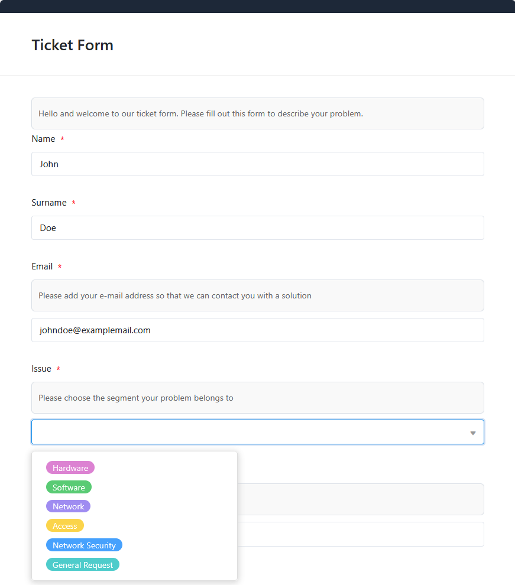
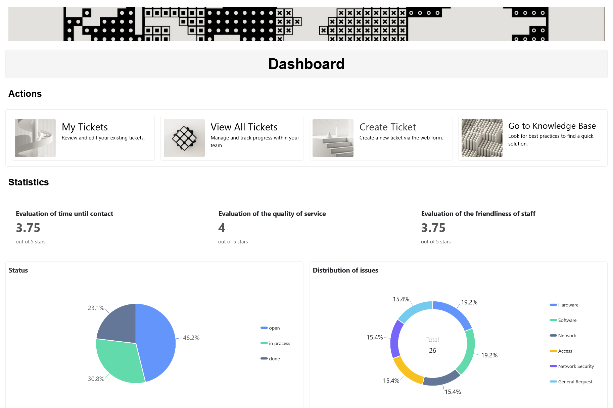

Un sistema de tickets en SeaTable le ayuda a registrar, organizar y resolver todas las solicitudes de soporte de forma centralizada. Con estesoftware de helpdesk de TI, puede controlar todos los procesos -desde el procesamiento de nuevas solicitudes hasta la gestión del conocimiento y la calidad del servicio- de forma eficiente y estructurada.

## Registre y gestione sus tickets de forma centralizada

La tabla central del software del servicio de asistencia registra todas las solicitudes entrantes a través de unformulario webpersonalizable.

Puede asignar a cada entrada información importante comoel estado, laprioridady unapersona responsable. Gracias a la asignación automática a los miembros de su equipo en función de las responsabilidades previamente definidas y a un sencillo cambio de estado de "abierto" a "en curso" o "finalizado", siempre tendrá una visión de conjunto.

## Ahorre tiempo y nervios con una gestión eficaz del conocimiento

Puede guardar instrucciones útiles, procesos estándar y mejores prácticas en labase de conocimientosintegrada para que la resolución de problemas y el procesamiento sean más eficientes. Su software de asistencia informática se convierte así en la fuente central de información para responder a las consultas recurrentes de forma rápida y coherente.

## Obtenga información directa con el formulario de valoración

Utilice elformulario de valoraciónpara recibir comentarios de las personas que han creado un ticket a través del formulario de contacto. Mediante columnas de valoración personalizables, los usuarios pueden indicar rápidamentesu grado de satisfacción con la asistencia. Esto le permite reconocer los puntos fuertes y las áreas de mejora de un vistazo, y hacer que su servicio de asistencia sea un poco mejor cada día.

## Utiliza funciones valiosas para un proceso fluido

- Plugin Kanban: organice sus solicitudes de asistencia de forma visual. Cada empleado puede ver el estado de los tickets de un vistazo y puede actualizarlos mediante arrastrar y soltar.
- Correos electrónicos automatizadoscon sólo pulsar un botón: en cuanto haya cerrado una incidencia, puede enviar automáticamente un mensaje con un enlace al formulario de comentarios a través de un botón.
- Estadísticas: Visualice los datos de sus tickets y analice KPI importantes como el progreso o la satisfacción del cliente. Esto le permite optimizar continuamente sus procesos de asistencia y garantizar un flujo de trabajo fluido con su software de asistencia informática.

Plugin Kanban: organice sus solicitudes de asistencia de forma visual. Cada empleado puede ver el estado de los tickets de un vistazo y puede actualizarlos mediante arrastrar y soltar.

Correos electrónicos automatizadoscon sólo pulsar un botón: en cuanto haya cerrado una incidencia, puede enviar automáticamente un mensaje con un enlace al formulario de comentarios a través de un botón.

Estadísticas: Visualice los datos de sus tickets y analice KPI importantes como el progreso o la satisfacción del cliente. Esto le permite optimizar continuamente sus procesos de asistencia y garantizar un flujo de trabajo fluido con su software de asistencia informática.

## Las ventajas del software de asistencia informática como aplicación

Laaplicación integradadel software del servicio de asistencia ofrece aún más. Una interfaz clara e intuitiva le permite crear unpanel de control personalizadoque puede adaptar a sus necesidades con poco esfuerzo. Los nuevos tickets se pueden crear con unos pocos clics mediante el formulario web y la información relevante se puede buscar directamente en labase de conocimientos. La clara vista Kanban filtra los tickets en función del usuario, de modo que sólo lostickets relevantes para ustedson visibles en su tablero. También puede configurar individualmentequién puede ver y editar qué datospara proteger sus tickets de accesos no autorizados.

## Ventajas de SeaTable como software de helpdesk

-Gratuito: Comience con la versión gratuita de SeaTable, que ya incluye numerosas funciones. Si lo desea, puede actualizarla para obtener más funciones o espacio de almacenamiento.

-Colaboración: Gracias a la sincronización en tiempo real, SeaTable facilita enormemente la colaboración en equipo. Varios usuarios pueden trabajar en tickets, actualizar datos y dejar comentarios al mismo tiempo.

-Comodidad: si utiliza el software del servicio de asistencia en la nube, podrá acceder a los tickets desde cualquier lugar y en cualquier momento, y además estarán protegidos contra pérdidas.

-Flexible: Gracias a sus versátiles opciones de personalización, SeaTable puede utilizarse para una amplia gama de aplicaciones e integrarse perfectamente en diversos procesos empresariales.

-Seguro: Sus datos están protegidos de forma óptima con SeaTable. Puede elegir entre almacenarlos en la nube o en sus instalaciones. Gracias al cumplimiento de la normativa GDPR y a los derechos de acceso individuales, conservará el control total en todo momento.

-Escalable: Desde el uso inicial con unos pocos empleados hasta una solución para toda la empresa, SeaTable crece con sus necesidades. Solo pagará por las funciones y los recursos que realmente utilice.

## Plantilla interactiva

Desplácese por nuestra plantilla incrustada de forma interactiva o lea la descripción haciendo clic en el símbolo i que aparece tras el nombre de la plantilla. Así podrá hacerse una idea más precisa de las funciones del software de asistencia informática. Si tiene alguna pregunta o duda, le recomendamos nuestrasección de ayuda.
