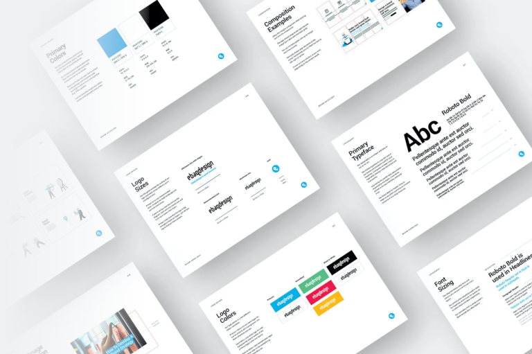

## Typische Markdown Formatierungen

Die Blogbeiträge, die wir mit Hugo schreiben, unterstützen die typischen [Markdown Formate](https://www.markdownguide.org/basic-syntax/):

- Überschriften mit `##`, `###` etc.
- Paragraphen getrennt `ENTER`
- Erzwungende einfache Zeilenumbrüche durch zwei Leerzeichen am Ende der Zeile
- **Fett-** und _Kursivschrift_ durch `**Fett-**` oder `*Kursivschrift*`
- Aufzählungslisten durch `- xxx` oder `1. xxx`
- horizontale Linien durch `---`
- Quotes mit `>`

> **Markdown ist wirklich einfach zu erlernen**. Ihr werdet sehen, dass Ihr maximal ein paar Stunden braucht, um damit zurechtzukommen.
>
> -- Christoph Dyllick-Brenzinger

---

## Grafiken

Grafiken lassen sich mit dem folgenden Format einfügen, wobei Graffiken und Blogtexte im gleichen Ordner gespeichert werden.

- ``
- ``


Weitere Hinweise:

- Maximale Bildbreite im Blog ist **768px**. Bilder sollten optimalerweise in dieser Breite bereitgestellt werden.
- Der Blog wandelt JPG automatisch in webp um.
- JPG ist kleiner als PNG. Somit JPG bevorzugen.
- `feature.jpg` wird automatisch für den Header-Block des Artikels verwendet.

## Links

### Externe Links

E-Mailadressen wie cdb@seatable.io und externe URLs wie https://www.google.de werden im Fließtext automatisch in Links umgewandelt.

Für einen anderen Link-Text muss dieser in eckigen Klammern angegeben werden:

`[Zu Google](https://www.google.de)` erzeugt [Zu Google](https://www.google.de).

Externe links erhalten automatisch `target="_blank"` und `rel="nofollow"`.

### Interne Links

Für interne Links in den Blog-Beiträgen, wird die folgende Formatierung verwendet:

- `[Zur Registrierung]()`
- `[Mehr zu SeaTable Server]()`
- `[Blog-Artikel Cloud-Computing]()`

Der Pfad entspricht dem tatsächlichen Pfad ausgehende von `/src/content/`.

Sollte man eine Zielsprache erzwingen wollen, dann kann man das auch tun:

`[Zur französischen Registrierung]()`

### Anker Links

Die Überschriften eines Textes lassen sich einfach mit folgendem Markdown verlinken:

`[Zum Abschnitt X](#anker-links)` -> [Zum Abschnitt X](#anker-links).

## Tabellen

Mit Markdown können auch Tabellen geschrieben werden.

```
|                     | **IaaS**              | **PaaS**              | **SaaS**    |
| ------------------- | --------------------- | --------------------- | ----------- |
| **Art des Service** | Infrastruktur         | Entwicklungsplattform | Software    |
| **Zielgruppe**      | Systemadministratoren | Software-Entwickler   | Nutzer      |
| **Beispiele**       | Server, Netzwerke     | App-Entwicklung       |  |
```

|                     | **IaaS**              | **PaaS**              | **SaaS**                    |
| ------------------- | --------------------- | --------------------- | --------------------------- |
| **Art des Service** | Infrastruktur         | Entwicklungsplattform | Software                    |
| **Zielgruppe**      | Systemadministratoren | Software-Entwickler   | Nutzer                      |
| **Beispiele**       | Server, Netzwerke     | App-Entwicklung       |  |

## SeaTable Templates

### Template (alleine)

Es können SeaTable Templates direkt in die Blog-Posts eingebunden werden. Hierfür wird der **External Link** der Base benötigt.
Aus z.B. `https://cloud.seatable.io/dtable/external-links/3ab08a59c6b34166b852/` wird die Zeichenfolge nach `external-links` benötigt.

Die Einbindung in den Blog erfolgt über diesen Befehl:

```


```

Die Höhe ist ein optionaler Parameter und kann weggelassen werden. Standardmäßig wird eine Höhe von 667px verwendet.



### Template-Box

Nur `id` ist verpflichtend. Die anderen Parameter `submit` und `text` sind optional und nutzen dann Standardtexte.

```

```



## FAQs

Folgende Syntax erzeugt einen FAQ-Abschnitt in einem Blogbeitrag:



Ja, **Markdown** kann verwendet werden und somit auch Aufzählungen enthalten:

- Option A
- Option B





Ja. Man kann sowohl Bilder als auch Links in einem FAQ-Abschnitt verwenden.

Z.B.: [Kontaktiere uns]().





<br>

Der zugehörige Code dazu sieht so aus:

```


Ja, **Markdown** kann verwendet werden und somit auch Aufzählungen enthalten:

- Option A
- Option B





Ja. Man kann sowohl Bilder als auch Links in einem FAQ-Abschnitt verwenden.

Z.B.: [Kontaktiere uns]().



```

## Buttons

```

```

Auch hier wird wie bei der internen Verlinkungen der Pfad der Zielseite unterhalb von `src/content` verwendet, damit automatisch auf die richtige URL verlinkt wird.

Erlaubte Werte für `position` sind

- `left` (standard)
- `center`
- `right`

Erlaubte Werte für `style` sind:

- `primary` (default)
- `secondary`



## Warnings

Warn-Hinweise können auf zwei verschiedene Arten geschreiben werden. Bei einfachen Texten genügt ein inline Parameter, bei längeren Texten mit Absätzen und Formatierungen, empfiehlt sich die längere Schreibweise.

### Kurzschreibweise

```

```



Wichtig: Dieser Shortcode verlangt zwingend ein `/` am Ende bei `/>}}`.

### Langschreibweise

```


Hier kann beliebiger Text und Aufzählungen hin:

1. asdafd
2. asdfafda


```



Hier kann beliebiger Text und Aufzählungen hin:

1. asdafd
2. asdfafda



## YouTube

Um ein YouTube-Video mit dieser URL anzuzeigen:

```
https://www.youtube.com/watch?v=AHTzHMVx2uE
```

Fügen dies in dein Markdown ein:

```

```



## Keyboard

Um eine Tastenkombination wie z.B.  +  auszugeben, genügt folgender Shortcode:

```
 + 
```

## Tags

Das sind Tags, in den Farben ,  oder .
Hier die gesamte Übersicht:

- ...
- ...

## Icons

In den Blogbeiträgen oder Hilfeseiten können die Icons wie z.B.  mit dem folgenden Shortcode eingebunden werden. Dies funktioniert auch in Tabellen.

```


```

## SeaTable Icons

Die Icons der SeaTable Benutzeroberfläche wie z.B.  können im Fließtext eingebunden werden.
Die Namen des Icon kann man über die Entwicklertools des Browsers herausfinden.

```

```

## Verfügbar mit



## Kommentare

Im Markdown kann man einen Kommentar mit folgendem Code nutzen.
Dieser Kommentar ist zwar in den Markdown Dateien aber nicht im späteren Quellcode auf der Webseite sichtbar.

```
<!-- Das ist ein Kommentar -->
```

Hinweis: im Frontmatter kann man einen Kommentar mit `#` machen. Die Einrückungen müssen trotzdem erhalten bleiben.

```
sections:
  - name: "content-2"
    weight: 3
    # das ist ein Kommentar
    # das ist noch ein Kommentar.
```

## Customer

### Testimonial



SeaTable hat uns geholfen als Unternehmen sehr schnell, sehr flexibel und sehr effizient zu werden und zu bleiben.

Mit SeaTable können wir individuell auf die Bedarfe unserer Kunden eingehen, indem wir unsere **Arbeitsstrukturen anpassen** können, unseren Service optimieren können.



So verwendet man die Testimonials. Bei `images` kann entweder auf eine Grafik im gleichen Verzeichnis oder auf ein externes Bild per `https://` referenziert werden.
Die Grafik nimmt automatisch 2/6 der Breite ein. Bei kleiner Auflösung werden Bild und Text übereinander gestapelt.

```


Some text with **markdown format**.


```

### Story



Cloudvox SRL: Wie SeaTable **komplexe Daten** zugänglich macht



```


Cloudvox SRL: Wie SeaTable komplexe Daten zugänglich macht


```

Die Parameter `subtitle` und `link-text` sind optional. Wenn die Werte nicht gesetzt werden, wird der Standardtext in der jeweils passenden Sprache verwendet.

### Logo



```

```

## Newsletter

### Kurzform

Mit dem Shortcode `` kann man die Newsletter-Anmeldung in jeden Blog-Artikel einbauen.



### Langform

Alternativ kann man auch die beiden Überschriften, den Button-Text und die Beschreibung inviduell anpassen. Hier der dafür benötigte Shortcode:

```


Abonnieren Sie unseren **Newsletter** und bleiben Sie informiert! Hier funktioniert nun auch _Markdown_.


```



Abonnieren Sie unseren **Newsletter** und bleiben Sie informiert! Hier funktioniert nun auch _Markdown_.



## Registrierung in der Seitenleiste

Die Registerung in der Seitenleiste wird aktuell **nicht** in jedem Blog-Post angezeigt.
Man muss die Box bewußt einblenden mit `show: true`.

```
register:
    show: true
    title: 'Das ist der Title'
    items:
      - Wert 1
      - Wert 2
      - Wert 3
    submit: 'Ich will'
```

**Später** werden wir die Logik umdrehen und die Box standardmäßig anzeigen und dann kann man die mit folgendem Frontmatter-Eintrag ausblenden:

```
register: 'hide'
```

Default-Texte sind auch noch keine festgelegt.

## Tabs



## Carousel

Not yet ready ...


