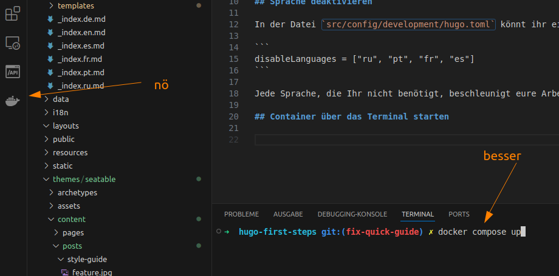
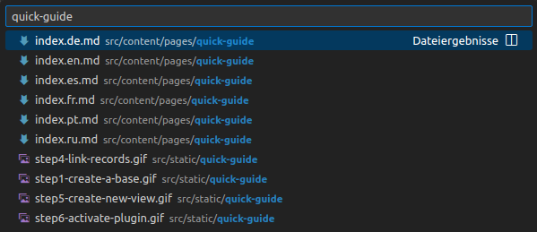
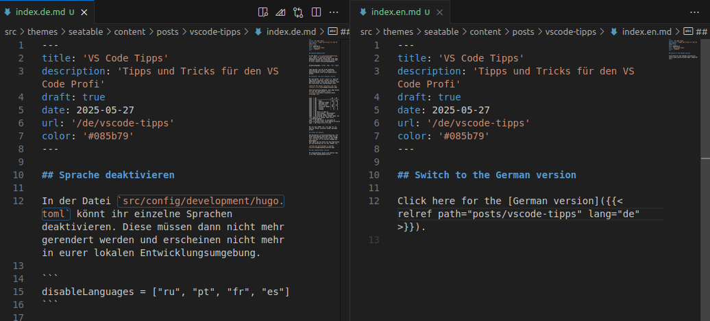

## Sprache deaktivieren

In der Datei `src/config/development/hugo.toml` könnt ihr einzelne Sprachen deaktivieren. Diese müssen dann nicht mehr gerendert werden und erscheinen nicht mehr in eurer lokalen Entwicklungsumgebung.

```
disableLanguages = ["ru", "pt", "fr", "es"]
```

Jede Sprache, die Ihr nicht benötigt, beschleunigt eure Arbeit. Deutsch und Englisch können nicht nicht deaktivieren werden.

## Container über das Terminal starten

Mit dem Befehl `docker compose up` kann der Hugo Docker Container schnell und einfach gestartet werden. Dies hat den Vorteil, dass man unmittelbar die Log-Meldungen sieht.



Diese Darstellung bedeutet, dass Hugo bereit ist und über den Browser [http://localhost:1313](http://localhost:1313) erreichbar ist:

```
hugo  | [0]                    | EN  | DE
hugo  | [0] -------------------+-----+------
hugo  | [0]   Pages            | 836 | 832
hugo  | [0]   Paginator pages  |   0 |   0
hugo  | [0]   Non-page files   |   0 |   0
hugo  | [0]   Static files     | 197 | 197
hugo  | [0]   Processed images | 701 |   0
hugo  | [0]   Aliases          |   5 |   1
hugo  | [0]   Cleaned          |   0 |   0
hugo  | [0]
hugo  | [0] Built in 2522 ms
hugo  | [0] Environment: "development"
hugo  | [0] Serving pages from disk
hugo  | [0] Running in Fast Render Mode. For full rebuilds on change: hugo server --disableFastRender
hugo  | [0] Web Server is available at http://localhost:1313/ (bind address 0.0.0.0)
hugo  | [0] Press Ctrl+C to stop
```

Mit  +  kann der Docker Container wieder gestoppt werden.

## Öffnen von Dateien

Die Navigation im Verzeichnisbaum bzw. die Suche nach Dateien kann ganz schön nervig sein. Schneller geht es mit  +  und der Eingabe des Dateinamens.
Dann wählt man die Datei mit den Pfeiltasten aus und bestätigt mit .



## Tabs nebeneinander stellen

Per Drag-and-Drop lassen sich mehrere Tabs in VS Code nebeneinanderstellen.



## Mehrere Cursors setzen

Mit gedrückter  Taste können mehrere Cursor in einem Dokument gesetzt werden. Alle Vorkommnisse eines Wortes können durch das Markieren und anschließendes Drücken von  +  ausgewählt werden. Jedes  +  setzt einen zusätzlichen Cursor und markiert das zusätzliche Wort.

## Suchen und Ersetzen

Die **Suchen und Ersetzen** Funktion von VS Code bietet eine leistungsstarke Möglichkeit Änderungen über viele Dateien hinweg durchzuführen. Folgende Dinge sollten dabei beachtet werden:

- Idealerweise legt man vor jeder umfangreichen **Suchen und Ersetzen** Aktionen einen **Commit** an. So kann man die Änderungen mit zwei Mausclicks rückgängig machen.
- Man sollte von Speziell zu Allgemein ersetzen.
    - Also erst `seatable.io/vorlagen/?lang=auto` ersetzen
    - Dann `seatable.io/vorlagen/`
    - Ansonsten bleiben Fragmente wie `?lang=auto` zurück.
- **Einschließende Dateien** erlaubt die Verwendung von `*`oder`**`. Z.B.:
    - `src/content/help/**/index.fr.md` bearbeitet nur französische Hilfeartikel
    - `src/content/templates/events/**/index.*.md` bearbeitet nur Vorlagen im Bereich Events, dafür alle Sprachen
